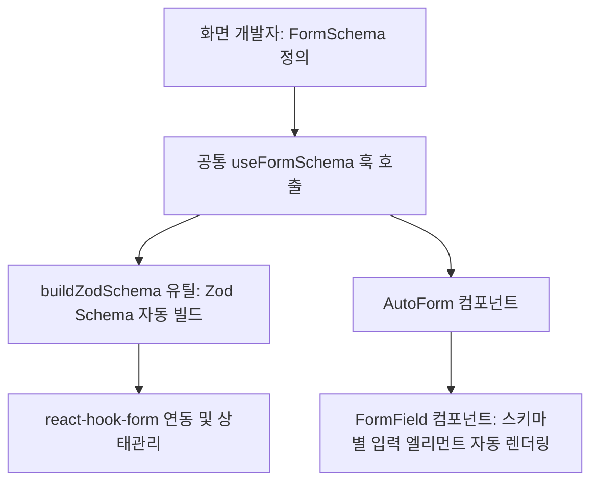

# React 공통 Validator 구현 계획

본 문서는 `everportal` (React + Vite + TypeScript) 프로젝트에서 기존 Apache Commons Validator XML 방식을 대체하는 **Schema-driven Form Validation 공통 레이어**의 설계 및 구현 방안을 정리한 최종 계획서입니다.

---

## 1. 아키텍처 개요

기존의 방식은 각 화면에서 여러 개의 `useState`로 상태를 개별 관리하고 검증 로직이 중구난방(`if (!field) { alert(...); }`)으로 나열되어 있었습니다. 
새로 도입되는 방식은 화면 개발자가 단일 **필드 스키마**를 작성하면, 공통 레이어가 이를 읽어 **상태 관리, 에러 메시지 렌더링, 폼 제출 및 유효성 검증**까지 자동화하는 구조입니다.



---

## 2. 구현 구조 및 디렉토리 구성

프론트엔드 프로젝트인 `everportal` 내부 공통 폴더에 Validator 엔진과 폼 컴포넌트들이 추가되어 구현이 완료되었습니다.

- **공통 검증 모듈 디렉토리**:
  - [types.ts](file:///c:/ST-onesIDE/workspace/PORTAL-STANDARD/everportal/src/common/validator/types.ts): 스키마 데이터 구조 및 필드 타입 인터페이스 정의
  - [buildZodSchema.ts](file:///c:/ST-onesIDE/workspace/PORTAL-STANDARD/everportal/src/common/validator/buildZodSchema.ts): `FormSchema` 정보를 입력받아 `zod` 검증 스키마를 빌드하는 유틸
  - [useFormSchema.ts](file:///c:/ST-onesIDE/workspace/PORTAL-STANDARD/everportal/src/common/validator/useFormSchema.ts): `react-hook-form` + `zodResolver`를 감싼 화면 연동용 공통 Custom Hook
- **공통 UI 컴포넌트 디렉토리**:
  - [FormField.tsx](file:///c:/ST-onesIDE/workspace/PORTAL-STANDARD/everportal/src/common/components/FormField.tsx): 스키마의 타입(`text`, `number`, `combo`, `date` 등)에 맞게 HTML 엘리먼트를 동적 렌더링하는 필드 컴포넌트
  - [AutoForm.tsx](file:///c:/ST-onesIDE/workspace/PORTAL-STANDARD/everportal/src/common/components/AutoForm.tsx): 스키마와 제출 핸들러를 주입받아 양식 전체를 자동으로 그려주는 폼 래퍼 컴포넌트
  - [FormField.css](file:///c:/ST-onesIDE/workspace/PORTAL-STANDARD/everportal/src/common/components/FormField.css): 인라인 에러 메시지 및 유효성 상태 CSS 스타일 정의
- **화면 적용 (파일럿)**:
  - [mberInsert.schema.ts](file:///c:/ST-onesIDE/workspace/PORTAL-STANDARD/everportal/src/pages/user/member/mberInsert.schema.ts): 회원 등록 화면 스키마 정의 (기존 `MberManage.xml` 대체)

---

## 3. 핵심 모듈 상세 설명

### 3.1. 필드 스키마 타입 정의 (types.ts)
화면 개발자가 설정할 수 있는 스키마 명세를 정의합니다. 기존 XML의 `<field>` 속성을 TypeScript 타입으로 변환합니다.

> [!NOTE]
> 지원하는 필드 타입: `text`, `number`, `combo`, `date`, `textarea`, `email`, `tel`, `password`, `radio`, `checkbox`

```typescript
export interface FieldSchema {
  label: string;               // 필드 라벨 (에러 메시지에 사용)
  type: FieldType;             // 입력 엘리먼트 타입
  required?: boolean;          // 필수 여부
  maxlength?: number;          // 최대 글자수
  minlength?: number;          // 최소 글자수
  pattern?: RegExp;            // 정규식 검증
  min?: number;                // 숫자 최솟값
  max?: number;                // 숫자 최댓값
  options?: FieldOption[];     // combo/radio/checkbox 옵션 배열
  placeholder?: string;        // 입력 힌트
  disabled?: boolean;          // 비활성화
  readOnly?: boolean;          // 읽기 전용
  rows?: number;               // textarea 줄 수 (default: 4)
}
```

### 3.2. zod 스키마 자동 빌더 (buildZodSchema.ts)
`FieldSchema` 설정을 기반으로 검증 엔진인 `zod` 스키마를 즉석에서 빌드합니다.
- `required: true` 인 경우 필수 에러 문구(`...은(는) 필수 입력 항목입니다.`)를 일괄 생성합니다.
- 각 타입별 포맷 검증(이메일, 날짜 정규식 등)을 적용합니다.

### 3.3. 공통 Form 훅 (useFormSchema.ts)
`react-hook-form`의 복잡한 API를 래핑하여 화면단에서 깔끔한 형태로 꺼내 쓸 수 있도록 돕습니다.
```typescript
const { register, handleSubmit, errors, fieldProps, errorMessage } = useFormSchema(schema, defaultValues);
```
- **검증 시점**: `onBlur` (포커스를 잃었을 때) 동작하여 사용자의 입력 흐름을 해치지 않습니다.
- **필드 바인딩**: `<input {...fieldProps('fieldId')} />`와 같이 심플한 구조로 연동할 수 있습니다.

### 3.4. FormField 및 AutoForm 컴포넌트
- **`FormField`**: 스키마의 `type`에 따라 `<select>`, `<textarea>`, `<input type="date">` 등으로 알아서 분기 렌더링하고, 하단에 에러를 인라인으로 표시합니다.
- **`AutoForm`**: 전체 스키마 데이터를 전달받아 별도 마크업 없이도 완성도 높은 검증 폼을 렌더링할 수 있습니다.

---

## 4. 파일럿 마이그레이션 예제: 회원 가입 ([mberInsert.schema.ts](file:///c:/ST-onesIDE/workspace/PORTAL-STANDARD/everportal/src/pages/user/member/mberInsert.schema.ts))

기존 `MberManage.xml` 유효성 검증 명세를 바탕으로 구성된 스키마의 일부 예시입니다.

```typescript
export const mberInsertSchema: FormSchema<MberInsertForm> = {
  mberId: {
    label: '일반회원아이디',
    type: 'text',
    required: true,
    maxlength: 20,
    placeholder: '아이디를 입력하세요',
  },
  middleTelno: {
    label: '집중간전화번호',
    type: 'tel',
    maxlength: 4,
    pattern: /^[0-9]*$/,
  },
  mberEmailAdres: {
    label: '이메일주소',
    type: 'email',
    placeholder: 'example@email.com',
  },
  mberSttus: {
    label: '일반회원상태코드',
    type: 'combo',
    required: true,
    options: [], // 컴포넌트 수준에서 동적으로 주입 가능
  },
};
```

---

## 5. 화면 마이그레이션 우선순위 및 규칙

기존 Commons Validator XML에 대응하는 React 컴포넌트를 마이그레이션하는 가이드라인입니다.

### 5.1. XML 검증 룰 매핑 표
기존 XML 파일(`eversrm/src/main/resources/validator/`) 내 `<field>` 설정을 Schema 속성으로 일대일 치환합니다.

| XML depends 속성 | Schema 속성 | 예시 |
| :--- | :--- | :--- |
| `required` | `required: true` | `required: true` |
| `maxlength` + `<var>` | `maxlength: N` | `maxlength: 20` |
| `minlength` + `<var>` | `minlength: N` | `minlength: 8` |
| `email` | `type: 'email'` | `type: 'email'` |
| `mask` + `<var-value>` | `pattern: /regex/` | `pattern: /^[0-9]*$/` |
| `integer` | `type: 'number'` | `type: 'number'` |
| `date` | `type: 'date'` | `type: 'date'` |

### 5.2. 마이그레이션 대상 목록
기존 프로젝트 내의 XML 검증 명세를 리액트 공통 구조로 순차 마이그레이션합니다.

| 우선순위 | XML 경로 | 대응 React 컴포넌트 | 비고 |
| :--- | :--- | :--- | :--- |
| **높음** | `user/member/UserManage.xml` | `EgovMberInsert.tsx` | 파일럿 적용 대상 (진행 중) |
| **높음** | `user/member/MberManage.xml` | `EgovMberManage.tsx` | 회원 수정 및 관리 화면 |
| **높음** | `user/member/Password.xml` | `EgovMberPasswordUpdt.tsx` | 패스워드 변경 |
| 중간 | `board/bbs/BdMstrRegist.xml` | `EgovBbsMasterRegist.tsx` | 게시판 등록 |
| 중간 | `board/bbs/NoticeRegist.xml` | `EgovNoticeRegist.tsx` | 공지사항 등록 |
| 중간 | `system/menu/mcm/MenuCreat.xml` | `EgovMenuCreat.tsx` | 메뉴 생성 관리 |
| 낮음 | `auth/uia/LoginPolicy.xml` | `EgovLoginPolicy.tsx` | 로그인 정책 검증 |
| 낮음 | `user/help/faq/FaqManage.xml` | `EgovFaqManage.tsx` | FAQ 관리 등록 |
| 낮음 | `user/help/qna/QnaManage.xml` | `EgovQnaManage.tsx` | Q&A 관리 등록 |

---

## 6. Phase 3: 고도화 계획 (향후 추가 예정)

- [ ] **조건부 렌더링 / 검증**: 특정 필드의 값에 의존하는 기능 구현 (`dependsOn` 필드 및 검증 핸들러 지원)
- [ ] **파일 업로드 통합**: `type: 'file'` 타입을 추가하여 드롭존 및 업로드 유효성 처리 통합
- [ ] **동적 스키마 로딩**: 백엔드 API 서버를 통해 DB에 저장된 필드 메타데이터를 스키마로 불러와 동적으로 폼을 렌더링하는 폼 빌더 개발

---

## 7. 검증 및 빌드 확인

1. **의존성 설치 확인**:
   ```bash
   cd everportal && npm install react-hook-form zod @hookform/resolvers
   ```
2. **TypeScript 정적 컴파일 컴파일 확인**:
   ```bash
   npx tsc --noEmit
   ```
   *수행 결과: 에러가 검출되지 않아야 정상입니다.*

