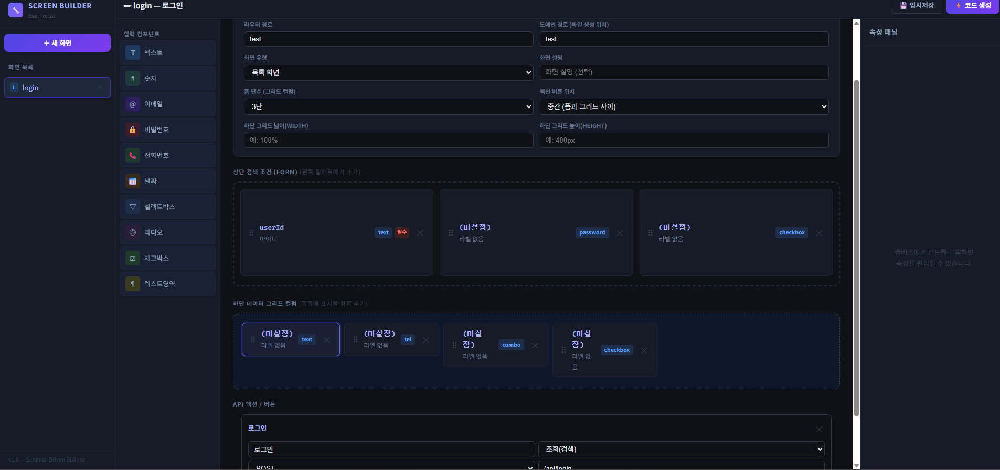

1. 영역 구분
 - 화면 기본정보 영역 : 화면에 대한 기본 정보를 입력한다.
 - 폼(form) 영역 : 폼의 대한 기본 정보를 입력한다.
   - 폼영역을 추가(+), 삭제(-) 할 수 있다
   - 폼 아이디로 화면내부에서 폼을 구분할 수 있다. 폼이름은 실제 저장시 폼의 id를 사용한다.
   - 폼 타이틀 입력
   - 폼 column, row 갯수 입력
   - 폼에 항목 추가, 삭제, 순서변경
   - 항목별 기본값 설정
   - placeHolder 설정
 - 그리드(grid) 영역 : 테이블에 대한 기본 정보를 입력한다.
   - 그리드영역을 추가(+), 삭제(-) 할 수 있다
   - 그리드 아이디로 화면내부에서 그리드를 구분할 수 있다. 그리드이름은 실제 저장시 그리드의 id를 사용한다.
   - 그리드 타이틀 입력
   - 그리드 column 갯수 입력하면 컬럼 자동 생성되고, column별로 속성정의(항목별 maxlength, length, 필수/옵션 등), 정렬, 항목 링크(클릭시 스크립트 실행)
   - 그리드에 항목 추가, 삭제, 순서변경
 - 액션(Action) 영역
   - 버튼 width, height, type, 클릭시 동작
   - 액션의 위치 설정 가능 (즉, 액셜별로 드래그 앤 드롭해서 화면에 넣을 수 있음)